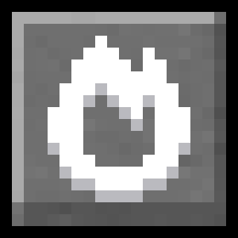
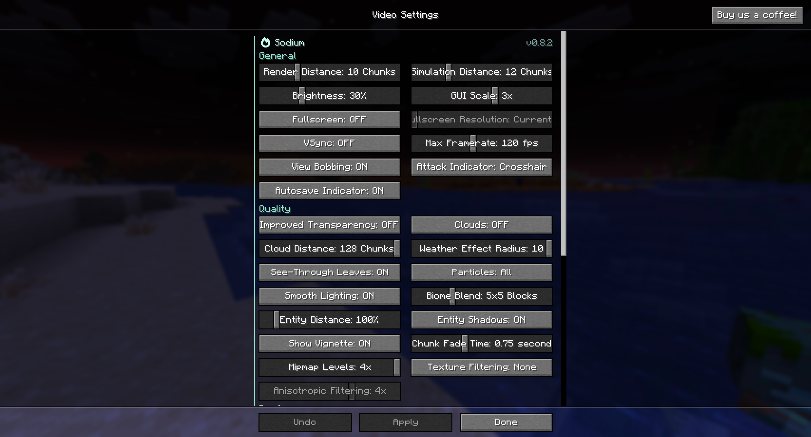
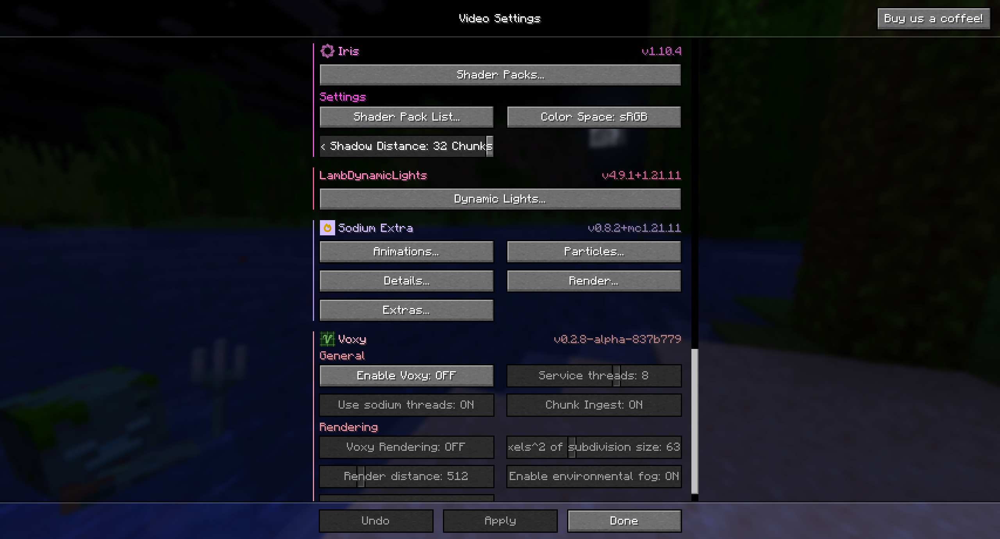

# Enchanted's Sodium Options

Enchanted's Sodium Options replaces Sodium's video settings screen with one that matches the aesthetic of vanilla Minecraft more closely.

## Features
- Supports all mods that use Sodium's configuration system
- Colours in the video settings screen can be disabled
- Alt + P keybind to open the default Sodium video settings screen if needed

## Supported Versions
- I will keep this mod updated to the latest version of Sodium
- This mod will not be backported to previous versions of Minecraft or Sodium due to Sodium lacking a proper config api in versions before `0.8`
- Forks of Sodium won't be supported by this mod

## License

Enchanted's Sodium Options by <a rel="cc:attributionURL dct:creator" property="cc:attributionName" href="https://enchanted.games">ioblackshaw (a.k.a. Enchanted_Games)</a> is licensed under <a href="http://creativecommons.org/licenses/by-nc/4.0/?ref=chooser-v1" target="_blank" rel="license noopener noreferrer" style="display:inline-block;">CC BY-NC 4.0</a>
 
Video content creators may monetise videos including this work provided the license is followed.
